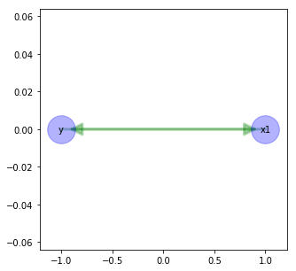
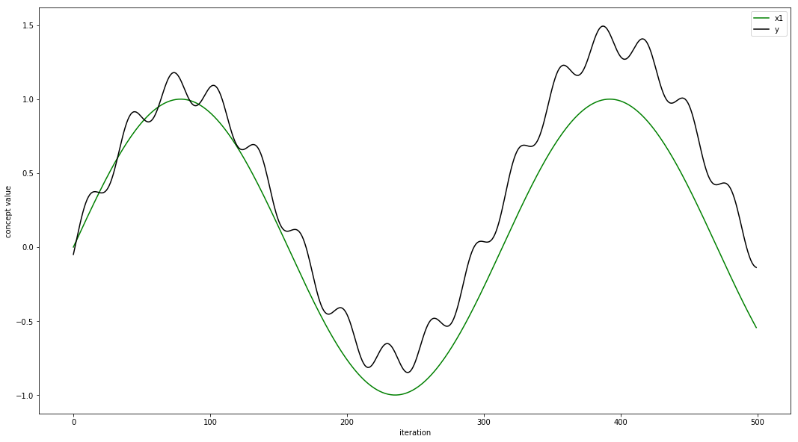
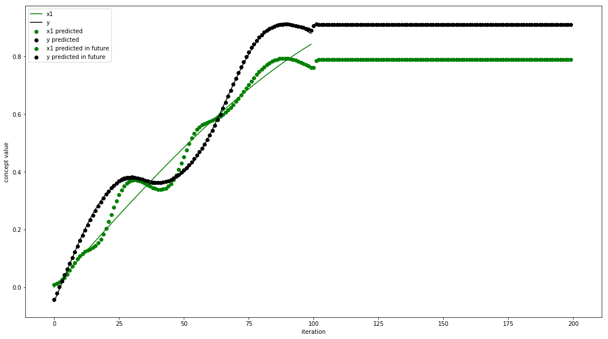
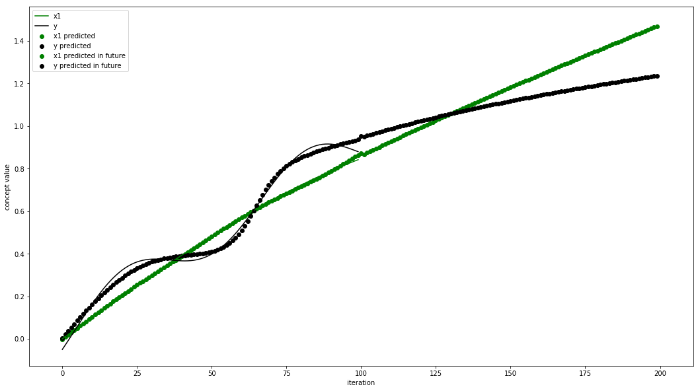
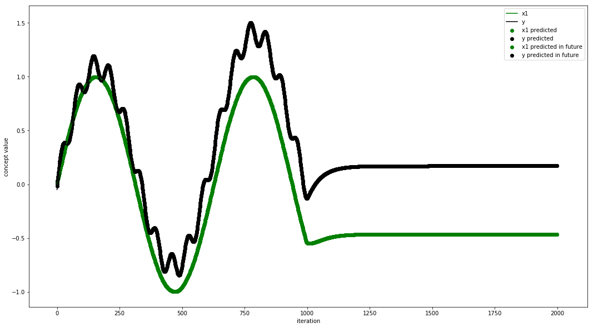
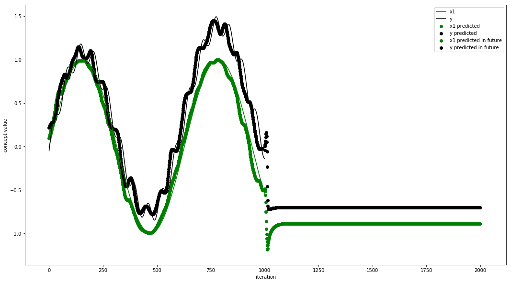
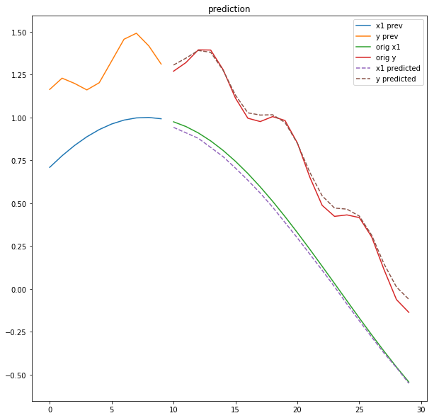

### Это тезисно о том, что прочитал, наэксперементировал, узнал
Опечатки пока не проверял, но в рспз обязательно сделаю, не забуду

## Цель

Исследование оптимальной архитектуры для карты и сети для предсказания
разных ф-ий.

Нейронечеткие карты -- это компромисс между нейронками и когнитивной моделью.

## Задача
Прогнозирования временных рядов.

<!--
    todo что-нибудь рассказать про сезонность, тренд
    какие задачи вообще решеются
-->

Задачи: <!-- source https://machinelearningmastery.com/how-to-develop-lstm-models-for-time-series-forecasting/ -->
* Можно предсказывать поведение одного ряда по его истории.
* Можно предсказывать несколько рядов по их истории.
* Можно предсказывать один ряд по истории нескольких.

При решении этих задач можно учитывать кучу разных факторов:
* какое кол-во шагов в прошлом будут влиять на будущее значение,
* какие именно ряды влияют на конкретный ряд
* на сколько шагов вперед модель должна сделать предсказание

<!-- todo посравнивать еще и с этими методами -->

## Методы решения:

http://www.machinelearning.ru/wiki/images/archive/c/cb/20160412121749!voron-ml-forecasting-slides.pdf
https://habr.com/ru/post/180409/

Предсказывать можно с помощью:
* Авторегрессионные модели
* Адаптивные модели
* Нейросетевые методы

Но кроме предсказания, мы бы хотели как-то поработать с нашей моделью,
поэксперементировать причинно-следственные связи и посмотреть на
реакцию модели при определенных значениях какого-то параметра.

Для этого нужно структурировать знания о системе. И тут мы получаем карту.
Карта -- это направленный граф. Вершины -- концепты, ребра описывают
взаимодействие между концептами.

Кроме этого, карта добавляет больше интерпретируемости результату вычислений.
Мы знаем причинно-следственные связи между концептами и на основе этих знаний
можем делать какие-то выводы.

Эксперт сам задает те связи, которые нужны. А "ненужные" связи не усложняют
модель и не позволяют модели переобучиться на данных для обучения.
Это можно сравнить с умным dropout'ом.

Еще одна особенность карты -- это рекуррентные связи.
Если эксперт при определении карты, создал цикл, то такая модель
будет получать обратную связь уже благодаря архитектруре, которую заложил в нее эксперт.
<!-- source https://web.stanford.edu/class/cs331b/2016/projects/wu_shen.pdf -->
Обратная связь -- это очень важно. Сети с обратной связью, теоретически,
проще поддаются Curriculum Learning + есть возможность Taxonomy Based Prediction
(хотя в карте, наверное, это никак не применить, наверное)

<!-- todo почитать побольше про затухающие и взрывающиеся градиенты -->

Карту по классическому алгоритму очень сложно настраивать.
И скорее всего, у нашего эксперта нет точных чисел о степени
влияния одного концепта на другой, а есть только знания о факте связи.

## Эксперимент

Можем объединить карту и нейронку -- тогда ее можно будет обучить на имеющейся
истории и эксперт не будет мучаться.

Проведем эксперимент с простой картой из 2 концептов, которые замыкаются в
цикл. И попробуем предсказать какую-нибудь ф-ю

Вот такую зависимость мы будем предсказывать

<!-- todo формула зависимости -->

<!-- todo указать на то, как обучалась карта и про каждый эксперипент, сколько итераций -->

Попробуем использовать просто нейронку. Из фич -- только значение на предыдущем шаге.

(Это попытка предсказать, что будет поле 100 точки на данных для обучения)

Конспекты выравниваются, потому что зависят только от предыдущего значения предшевствующих концептов. Если усложнить модель так, чтобы они зависели больше, чем от одного значения и было больше энтропии, то они бы так не сходились.

На последнем графике видно, как зависит y от x1 при значениях, больших, чем те данные, на которых была обучена сеть

По сути, получилось так, что x1 предсказывает y, а y предсказывает x1. Кроме того, зависимость будщего концепта вычисляется только на основе одного предыдущего значения соседнего концепта.

 Чтобы двигаться дальше, нужно какое-то генератор энтропии. Это может быть:
* более старые значения как из предыдущего временного ряда (потому что последующее значение может зависеть от последующих), так и из предшевствующих
* искусственные данные, например, номер итерации (но этот вариант имеет свои ограничения. нужно или правильно подбирать ф-ю активации, чтобы она была неограничена, или нормировать номер итерации)

Более радикальный способ -- это использовать рекуррентную нейросеть. Их особенность в том, что у них есть состояние. И это состояние способно обновляться. В то время, как веса в обычном прецептроне статичны.

### Искусственные данные (номер итерации)

Видно, что номер итерации внес энтропии, но
сеть не смогла обучиться, на что они влияют.
Но этот путь, на самом деле, тупиковый,
потому что данные на вход нейронки
нужно норировать, и поэтому бесконечно увеличивать
номер итерации, чтобы получить предсказание
не получится.

(что будет поле 100 точки на данных для обучения)

### Больше предыдущих значений

### 1 предыдущее значение

### 10 предыдущее значение

Это оказалось слишком много и карта стала неадекватной на новых данных

### LSTM

Мы передаем в сеть значения 10 предыдущих точек, а получаем 20 точек в будущем.

400 эпох, hidden_size=100

Каждый концепт смотрит и на свою старую историю, и на историю соседа

<!-- todo результаты экспериментов в сводную таблицу -->

<!-- Еще подумал, можно ли тут использовать encoder-decoder? Наверное, да. Но это совсем другая архитектура и мы потеряем в интерпретируемости модели. -->

----

## todo (вместо этого должны быть другие эксперименты)

На простом примере не понятно, зачем нужна вообще карта.

На самом деле, при увеличении количества концептов,
количества возможных связей между ними растет как факториал.
Поэтому в разреженных моделях (с большим кол-вом концептов,
но не очень большим кол-вом связей), такой подход может
сэкономить кучу памяти для хранения парамертов, времени при
обучении, еще и поможет избежать переобучения. А еще
легко интерпретируем.

Хотя в карте каждая связь довольно дорогая (но это настраивается).
Не уверен, что на самом деле там будет какой-то профит.
Но предсказывать она точно будет лучше, чем просто полносвязная нейронка.
<!-- Надо посчитать, поэксперементировать. -->

## Проблемы

После такой прокачки оптимизации весов, мы не можем простым образом
совмезать карты разных экспертов. По-хорошему, для этого нужно переобучение всей
карты, но теоретически, это кое-как будет работать даже если мы просто усредним значение
концепта, которое вычислим 2 разными нейронками.

## Что дальше?

* Можно ли хранить веса нейронок в разреженой матрице и делать вычисление для всей карты
на одном шаге итерации за одно умножение?
* Может быть внимание можно как-то заиспользовать?
* Как найти минимальное количества ребер, при котором
можно было бы более-менее адекватно предсказывать результирующий концепт?
* Может быть можно деревья решений преобразовать к карте и усложнить?
Деревья еще проще интерпретировать, они быстрые.
* Нужно дальше исследовать, как влияют рекуррентные связи
* Нужно поисследовать разные архитектуры карт, выделить какие-то свойства

---

Это получился управляемый ансамбль lstm'ок
